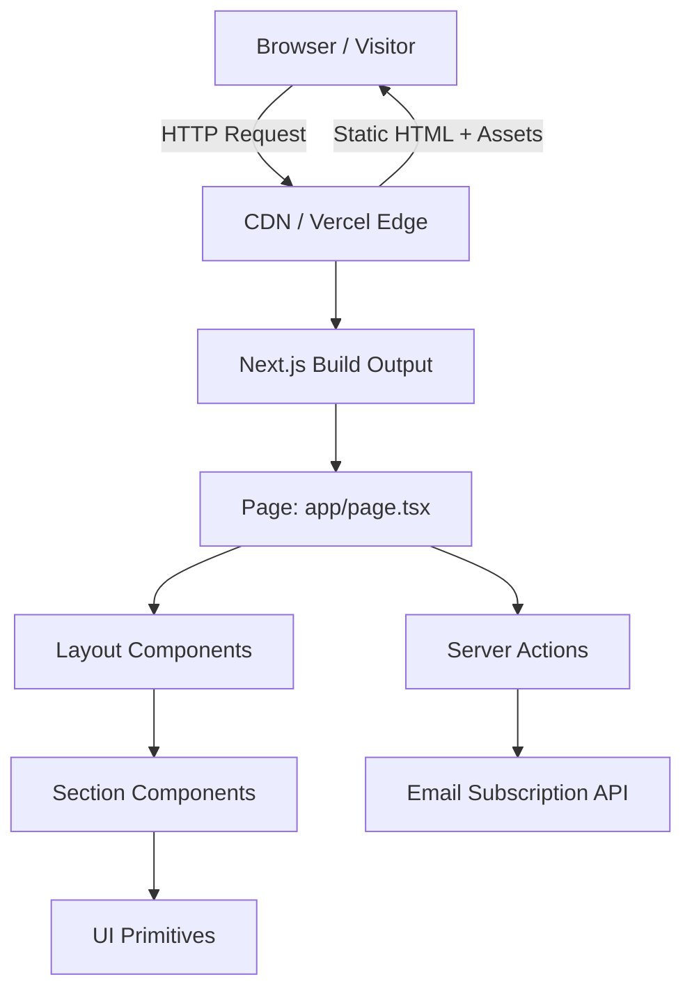
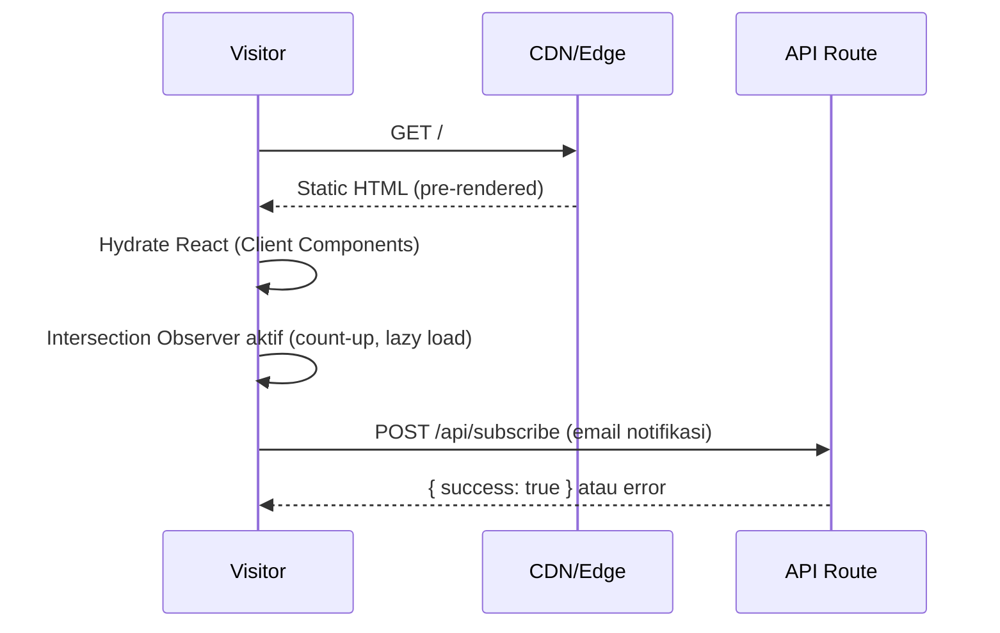
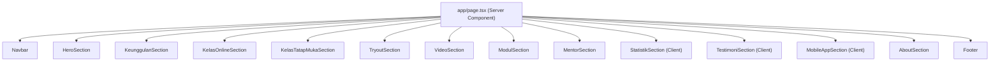

# Design Document — CendekiaPharma Landing Page

## Ikhtisar

CendekiaPharma Landing Page adalah halaman publik utama platform bimbingan belajar UKOM (Uji Kompetensi Mahasiswa Profesi Apoteker). Halaman ini berfungsi sebagai wajah digital platform: membangun kepercayaan calon peserta, menampilkan seluruh layanan, dan mendorong konversi pendaftaran.

**Tujuan utama:**
- Menyampaikan nilai platform secara jelas kepada mahasiswa profesi apoteker dan fresh graduate
- Menampilkan semua produk/layanan (kelas online, tatap muka, tryout, video, modul)
- Membangun social proof melalui statistik, testimoni, dan profil mentor
- Mengumpulkan email calon pengguna aplikasi mobile (coming soon)
- Memenuhi standar performa (<3 detik LCP), responsivitas (320px–1920px), SEO, dan aksesibilitas dasar

**Stack yang dipilih:** Next.js 14+ (App Router) dengan TypeScript dan Tailwind CSS

**Alasan pemilihan Next.js:**
- Server Components secara default → bundle JS client minimal, LCP lebih cepat
- Built-in `next/image` dengan optimasi WebP otomatis dan lazy loading
- Metadata API bawaan untuk SEO (title, description, Open Graph)
- Static Site Generation (SSG) cocok untuk landing page yang kontennya statis
- Ekosistem luas dan dokumentasi lengkap untuk education platform ([referensi](https://pagepro.co/blog/next-js-for-e-learning-platforms/))

---

## Arsitektur

Landing page ini dibangun sebagai **aplikasi Next.js statis (SSG)** — seluruh halaman di-render pada build time dan di-serve sebagai HTML statis, sehingga performa maksimal tanpa kebutuhan server runtime.

### Diagram Arsitektur Tingkat Tinggi



### Alur Rendering



### Struktur Direktori Proyek

```
cendekiapharma/
├── app/
│   ├── layout.tsx          # Root layout (metadata global, font)
│   ├── page.tsx            # Halaman utama (komposisi semua section)
│   └── api/
│       └── subscribe/
│           └── route.ts    # API Route: simpan email notifikasi
├── components/
│   ├── layout/
│   │   ├── Navbar.tsx
│   │   └── Footer.tsx
│   └── sections/
│       ├── HeroSection.tsx
│       ├── KeunggulanSection.tsx
│       ├── KelasOnlineSection.tsx
│       ├── KelasTatapMukaSection.tsx
│       ├── TryoutSection.tsx
│       ├── VideoSection.tsx
│       ├── ModulSection.tsx
│       ├── MentorSection.tsx
│       ├── StatistikSection.tsx
│       ├── TestimoniSection.tsx
│       ├── MobileAppSection.tsx
│       └── AboutSection.tsx
├── components/ui/           # Komponen UI primitif (Button, Card, Badge, dll.)
├── lib/
│   ├── constants.ts         # Data statis (mentor, testimoni, statistik, dll.)
│   └── utils.ts             # Helper functions
├── public/
│   ├── images/              # Gambar statis (WebP)
│   └── icons/               # SVG ikon
└── styles/
    └── globals.css          # Tailwind base + custom CSS variables
```

---

## Komponen dan Antarmuka

### Hierarki Komponen



> Komponen bertanda **(Client)** menggunakan `"use client"` karena memerlukan interaktivitas (animasi, carousel, form).

### Spesifikasi Komponen Utama

#### `Navbar`
- **Tipe:** Client Component (`"use client"`)
- **Props:** tidak ada (data navigasi dari constants)
- **State:** `isScrolled: boolean`, `isMobileMenuOpen: boolean`
- **Perilaku:**
  - `isScrolled` diset via `window.addEventListener('scroll')` — menambah shadow/background saat scroll
  - `isMobileMenuOpen` toggle saat hamburger diklik
  - Smooth scroll via `scrollIntoView({ behavior: 'smooth' })` saat link diklik
- **Breakpoint:** hamburger menu aktif di `< 768px`

#### `HeroSection`
- **Tipe:** Server Component
- **Konten:** headline, slogan, deskripsi, 2 tombol CTA, ilustrasi
- **Layout:** 2 kolom (teks kiri, ilustrasi kanan) di desktop; 1 kolom di mobile (ilustrasi di bawah)

#### `StatistikSection`
- **Tipe:** Client Component
- **Props:** `stats: StatItem[]`
- **State:** `hasAnimated: boolean`, `currentValues: number[]`
- **Perilaku:** Intersection Observer memicu count-up animation saat section masuk viewport
- **Animasi:** linear interpolation dari 0 ke nilai target selama 2 detik

#### `TestimoniSection`
- **Tipe:** Client Component
- **State:** `activeIndex: number`
- **Perilaku:** carousel dengan tombol prev/next; auto-play opsional; 1 kartu per tampilan di mobile

#### `MobileAppSection`
- **Tipe:** Client Component
- **State:** `email: string`, `status: 'idle' | 'loading' | 'success' | 'error'`, `errorMessage: string`
- **Perilaku:** validasi email client-side, submit ke `/api/subscribe`, tampilkan pesan konfirmasi/error

#### `Footer`
- **Tipe:** Server Component
- **Konten:** logo, navigasi, media sosial (buka tab baru), kontak, copyright, link Kebijakan Privasi & Syarat Ketentuan

### Antarmuka API

#### `POST /api/subscribe`

```typescript
// Request Body
interface SubscribeRequest {
  email: string;
}

// Response (success)
interface SubscribeResponse {
  success: true;
  message: string;
}

// Response (error)
interface SubscribeErrorResponse {
  success: false;
  error: string;
}
```

**Validasi server-side:** format email dengan regex standar RFC 5322 sederhana.

**Penyimpanan:** MVP — simpan ke file JSON lokal atau environment variable (dapat diganti database di iterasi berikutnya).

---

## Model Data

### Tipe Data Statis (constants.ts)

```typescript
// Poin keunggulan platform
interface KeunggulanItem {
  id: string;
  icon: string;          // nama ikon SVG
  title: string;
  description: string;   // maks 2 kalimat
}

// Profil mentor
interface MentorProfile {
  id: string;
  name: string;
  photo: string;         // path ke gambar WebP
  education: string;     // latar belakang pendidikan
  experience: string;    // pengalaman/spesialisasi
  specialization: string;
  badge: string;         // "Alumni Terbaik" | "Praktisi Aktif"
}

// Angka statistik
interface StatItem {
  id: string;
  value: number;         // nilai akhir animasi
  suffix: string;        // "+", "%", dll.
  label: string;         // deskripsi statistik
}

// Testimoni alumni
interface TestimoniItem {
  id: string;
  name: string;
  photo: string;
  batch: string;         // contoh: "Batch 42 - 2024"
  quote: string;
  rating: number;        // 1-5
}

// Item navigasi
interface NavItem {
  label: string;
  href: string;          // anchor ID, contoh: "#keunggulan"
}

// Thumbnail video
interface VideoItem {
  id: string;
  title: string;
  thumbnail: string;
  duration: string;
}

// Modul belajar
interface ModulItem {
  id: string;
  title: string;
  category: string;
  updatedAt: string;     // contoh: "Juni 2025"
  format: 'PDF' | 'Digital';
}
```

### Model Data Dinamis (API)

```typescript
// Data email subscriber (disimpan server-side)
interface EmailSubscriber {
  email: string;
  subscribedAt: string;  // ISO 8601 timestamp
  source: 'mobile-app-section';
}
```

### Konfigurasi Tema (Tailwind)

```typescript
// tailwind.config.ts — color palette dari logo CendekiaPharma
const colors = {
  'yale-blue': {
    500: '#1c7fe3',
    600: '#1666b6',
    700: '#114c88',
    // ... skala lengkap
  },
  'celadon': {
    500: '#4bb45b',
    600: '#3c9049',
  },
  'jungle-green': {
    500: '#5ba46d',
    600: '#488457',
  },
  'emerald': {
    500: '#55aa66',
    600: '#448852',
  },
  'fresh-sky': {
    500: '#21a2de',
    600: '#1b82b1',
  },
}
```

**Penggunaan warna:**
- `yale-blue-600` → warna primer (tombol CTA utama, heading)
- `celadon-500` → aksen hijau (badge, highlight fitur)
- `fresh-sky-500` → aksen biru muda (ikon, dekorasi)
- Teks utama: `#1a1a2e` (hampir hitam) di atas latar putih → rasio kontras > 4.5:1 ✓

### Sistem Tipografi

Font yang digunakan adalah **Plus Jakarta Sans** (Google Fonts) — modern, bersih, dan cocok untuk platform edukasi profesional.

```typescript
// app/layout.tsx
import { Plus_Jakarta_Sans } from 'next/font/google';

const plusJakartaSans = Plus_Jakarta_Sans({
  subsets: ['latin'],
  weight: ['400', '500', '600', '700', '800'],
  variable: '--font-plus-jakarta',
});
```

**Skala Tipografi (Tailwind):**

| Token | Ukuran | Line Height | Penggunaan |
|---|---|---|---|
| `text-5xl` / `text-6xl` | 48–60px | 1.1 | H1 — Headline Hero |
| `text-3xl` / `text-4xl` | 30–36px | 1.2 | H2 — Judul Section |
| `text-xl` / `text-2xl` | 20–24px | 1.3 | H3 — Sub-judul, Nama Mentor |
| `text-base` | 16px | 1.6 | Body text, deskripsi |
| `text-sm` | 14px | 1.5 | Caption, label, badge |
| `text-xs` | 12px | 1.4 | Footnote, copyright |

**Font Weight:**
- `font-extrabold` (800) → Headline Hero
- `font-bold` (700) → Judul Section, tombol CTA
- `font-semibold` (600) → Sub-judul, nama
- `font-medium` (500) → Label, badge
- `font-normal` (400) → Body text

### Responsive Breakpoints

Mengikuti breakpoint standar Tailwind CSS:

| Breakpoint | Lebar | Keterangan |
|---|---|---|
| `default` (mobile) | 320px – 639px | Layout 1 kolom, hamburger menu |
| `sm` | 640px – 767px | Layout 1–2 kolom, spacing lebih lega |
| `md` | 768px – 1023px | Navbar horizontal, layout 2 kolom |
| `lg` | 1024px – 1279px | Layout 3 kolom untuk grid section |
| `xl` | 1280px – 1535px | Layout penuh, max-width container |
| `2xl` | 1536px – 1920px | Max-width container tetap, padding lebih besar |

**Container max-width:** `max-w-7xl` (1280px) dengan padding horizontal `px-4 sm:px-6 lg:px-8`.

**Perilaku per section di mobile (< 768px):**
- `HeroSection`: 1 kolom, ilustrasi di bawah teks
- `KeunggulanSection`: grid 1 kolom → 2 kolom di `sm`
- `MentorSection`: carousel horizontal (1 kartu per tampilan)
- `TestimoniSection`: carousel (1 kartu per tampilan)
- `StatistikSection`: grid 2 kolom
- `Footer`: stack vertikal

### Pola Animasi dan Interaksi

**Prinsip animasi:** Subtle, purposeful, tidak mengganggu keterbacaan. Menggunakan CSS transitions dan Intersection Observer — tidak ada library animasi berat.

| Elemen | Animasi | Durasi | Trigger |
|---|---|---|---|
| Navbar background | `opacity` + `backdrop-blur` fade-in | 200ms | Scroll > 50px |
| Mobile menu | Slide-down + fade-in | 250ms | Klik hamburger |
| Section masuk viewport | Fade-up (`translateY(20px) → 0` + `opacity 0 → 1`) | 500ms | Intersection Observer |
| Count-up statistik | Linear interpolation 0 → target | 2000ms | Intersection Observer (sekali) |
| Tombol CTA hover | Scale `1 → 1.02` + shadow | 150ms | `:hover` |
| Kartu keunggulan hover | `translateY(0 → -4px)` + shadow | 200ms | `:hover` |
| Carousel slide | `translateX` smooth | 300ms | Klik prev/next |
| Form submit loading | Spinner + disabled state | — | Submit |

**Implementasi fade-up section:**
```typescript
// hooks/useIntersectionObserver.ts
export function useFadeInOnScroll(threshold = 0.1) {
  const ref = useRef<HTMLDivElement>(null);
  const [isVisible, setIsVisible] = useState(false);

  useEffect(() => {
    const observer = new IntersectionObserver(
      ([entry]) => { if (entry.isIntersecting) setIsVisible(true); },
      { threshold }
    );
    if (ref.current) observer.observe(ref.current);
    return () => observer.disconnect();
  }, [threshold]);

  return { ref, isVisible };
}
```

**Kelas Tailwind untuk animasi:**
```css
/* globals.css */
@keyframes fadeUp {
  from { opacity: 0; transform: translateY(20px); }
  to   { opacity: 1; transform: translateY(0); }
}
.animate-fade-up {
  animation: fadeUp 0.5s ease-out forwards;
}
```

---

## Correctness Properties

*A property is a characteristic or behavior that should hold true across all valid executions of a system — essentially, a formal statement about what the system should do. Properties serve as the bridge between human-readable specifications and machine-verifiable correctness guarantees.*

Setelah melakukan prework analysis terhadap seluruh acceptance criteria, berikut adalah property yang dapat diuji secara universal:

**Refleksi Redundansi:**
- Property rendering kartu keunggulan dan statistik keduanya menguji "komponen merender semua field data" — namun keduanya dipertahankan karena menguji komponen berbeda dengan struktur data berbeda.
- Property count-up animation dan carousel navigation keduanya menguji state transitions — tidak redundan karena menguji logika berbeda.
- Property validasi email dan alt text gambar adalah property independen yang tidak saling tumpang tindih.
- Property kontras warna adalah property murni matematis yang dapat diuji terpisah dari rendering.

### Property 1: Rendering Kartu Keunggulan Selalu Lengkap

*Untuk setiap* `KeunggulanItem` yang valid (memiliki id, icon, title, description), komponen kartu keunggulan yang dirender harus selalu menampilkan ikon, judul, dan deskripsi — tidak ada field yang hilang atau kosong dalam output render.

**Validates: Requirements 3.2**

---

### Property 2: Rendering Kartu Statistik Selalu Lengkap

*Untuk setiap* `StatItem` yang valid (memiliki value, suffix, label), komponen kartu statistik yang dirender harus selalu menampilkan nilai numerik (dengan suffix) dan label deskriptif — tidak ada field yang hilang dalam output render.

**Validates: Requirements 10.2**

---

### Property 3: Animasi Count-Up Selalu Dimulai dari Nol dan Berakhir di Nilai Target

*Untuk setiap* `StatItem` dengan nilai target `N` (bilangan bulat positif), animasi count-up harus dimulai dari nilai 0 dan berakhir tepat di nilai `N` setelah durasi animasi selesai — tidak pernah melebihi atau kurang dari nilai target.

**Validates: Requirements 10.3**

---

### Property 4: Navigasi Carousel Testimoni Selalu Konsisten

*Untuk setiap* array testimoni dengan panjang `N` (N ≥ 1) dan `activeIndex` awal manapun dalam rentang `[0, N-1]`, klik tombol "next" harus menghasilkan `activeIndex` baru `(activeIndex + 1) % N`, dan klik tombol "prev" harus menghasilkan `activeIndex` baru `(activeIndex - 1 + N) % N` — navigasi selalu wrapping dan tidak pernah keluar dari rentang valid.

**Validates: Requirements 11.3**

---

### Property 5: Validasi Email Menolak Semua Format Tidak Valid

*Untuk setiap* string yang bukan format email valid (string kosong, string tanpa karakter `@`, string tanpa domain setelah `@`, string dengan spasi, dll.), fungsi validasi email harus mengembalikan `false` dan form tidak boleh disubmit — tidak ada string non-email yang lolos validasi.

**Validates: Requirements 12.4**

---

### Property 6: Semua Elemen Gambar Memiliki Alt Text Non-Kosong

*Untuk setiap* komponen yang merender elemen `` atau `<Image>` (Next.js), atribut `alt` harus selalu ada dan tidak boleh berupa string kosong `""` — setiap gambar yang dirender memiliki deskripsi aksesibel.

**Validates: Requirements 16.3**

---

### Property 7: Semua Pasangan Warna Memenuhi Rasio Kontras Minimal

*Untuk setiap* pasangan warna teks dan warna latar belakang yang didefinisikan dalam design system (color palette CendekiaPharma), fungsi kalkulasi rasio kontras WCAG harus mengembalikan nilai ≥ 4.5 untuk teks berukuran normal — tidak ada kombinasi warna yang digunakan dalam komponen yang melanggar standar kontras aksesibilitas.

**Validates: Requirements 16.4**

---

## Penanganan Error

### Error pada Form Langganan Email (MobileAppSection)

| Kondisi | Pesan Error | Tindakan |
|---|---|---|
| Email kosong | "Alamat email tidak boleh kosong" | Tampilkan di bawah input, fokus ke input |
| Format email tidak valid | "Format email tidak valid. Contoh: nama@domain.com" | Tampilkan di bawah input |
| Server error (5xx) | "Terjadi kesalahan. Silakan coba lagi." | Tampilkan pesan, aktifkan tombol kembali |
| Network error | "Koneksi gagal. Periksa koneksi internet Anda." | Tampilkan pesan, aktifkan tombol kembali |
| Email sudah terdaftar | "Email ini sudah terdaftar untuk notifikasi." | Tampilkan pesan informatif (bukan error) |

### Error pada Komponen Gambar

- Semua gambar menggunakan `next/image` dengan prop `placeholder="blur"` dan `blurDataURL` — jika gambar gagal dimuat, placeholder blur tetap ditampilkan.
- Gambar mentor dan testimoni menggunakan fallback avatar SVG jika URL gambar tidak dapat dimuat (via `onError` handler).

### Error pada Animasi Count-Up

- Jika `IntersectionObserver` tidak didukung browser (browser lama), animasi dilewati dan nilai akhir langsung ditampilkan tanpa animasi — tidak ada error yang terlihat pengguna.

### Error pada Carousel Testimoni

- Jika array testimoni kosong, komponen menampilkan pesan fallback "Testimoni segera hadir" — tidak ada crash atau tampilan kosong.

---

## Strategi Pengujian

### Pendekatan Pengujian Ganda

Pengujian landing page ini menggunakan dua pendekatan komplementer:

1. **Unit Tests (Example-Based)** — untuk perilaku spesifik, rendering konten statis, dan interaksi UI
2. **Property-Based Tests** — untuk property universal yang harus berlaku di semua input (validasi, rendering, animasi, navigasi)

### Library yang Digunakan

| Kebutuhan | Library |
|---|---|
| Unit & Component Testing | [Vitest](https://vitest.dev/) + [React Testing Library](https://testing-library.com/docs/react-testing-library/intro/) |
| Property-Based Testing | [fast-check](https://fast-check.io/) |
| E2E Testing (opsional) | [Playwright](https://playwright.dev/) |

### Implementasi Property-Based Tests

Setiap property test menggunakan `fast-check` dengan minimal **100 iterasi** per property. Setiap test diberi tag komentar yang mereferensikan property di dokumen desain ini.

```typescript
// Contoh: Property 5 — Validasi Email
import fc from 'fast-check';
import { validateEmail } from '@/lib/utils';

// Feature: cendekiapharma-landing-page, Property 5: Validasi email menolak semua format tidak valid
test('validateEmail menolak semua string non-email', () => {
  fc.assert(
    fc.property(
      fc.oneof(
        fc.constant(''),                          // string kosong
        fc.string().filter(s => !s.includes('@')), // tanpa @
        fc.string().map(s => s + '@'),             // tanpa domain
        fc.string().filter(s => s.includes(' ')), // dengan spasi
      ),
      (invalidEmail) => {
        expect(validateEmail(invalidEmail)).toBe(false);
      }
    ),
    { numRuns: 100 }
  );
});
```

```typescript
// Contoh: Property 4 — Navigasi Carousel
import fc from 'fast-check';

// Feature: cendekiapharma-landing-page, Property 4: Navigasi carousel selalu konsisten
test('carousel next/prev navigation wraps correctly', () => {
  fc.assert(
    fc.property(
      fc.array(fc.string(), { minLength: 1, maxLength: 20 }),
      fc.nat(),
      (items, startIndexRaw) => {
        const N = items.length;
        const startIndex = startIndexRaw % N;
        const expectedNext = (startIndex + 1) % N;
        const expectedPrev = (startIndex - 1 + N) % N;
        expect(getNextIndex(startIndex, N)).toBe(expectedNext);
        expect(getPrevIndex(startIndex, N)).toBe(expectedPrev);
      }
    ),
    { numRuns: 100 }
  );
});
```

### Cakupan Unit Tests

| Komponen | Skenario yang Diuji |
|---|---|
| `Navbar` | Render semua link navigasi; hamburger toggle; sticky class saat scroll |
| `HeroSection` | Render headline, slogan, 2 CTA; layout mobile 1 kolom |
| `KeunggulanSection` | Minimal 4 item ditampilkan; setiap item punya ikon, judul, deskripsi |
| `StatistikSection` | Minimal 3 stat item; count-up dimulai dari 0 |
| `TestimoniSection` | Minimal 5 testimoni; carousel next/prev berfungsi |
| `MobileAppSection` | Form render; submit email valid → pesan sukses; email invalid → pesan error |
| `Footer` | Link sosmed buka tab baru; link Kebijakan Privasi ada |
| `validateEmail()` | Email valid diterima; berbagai format tidak valid ditolak |
| `getContrastRatio()` | Semua pasangan warna design system ≥ 4.5:1 |

### Pengujian Performa

- **Lighthouse CI** dijalankan pada setiap PR untuk memastikan LCP < 3 detik (Requirement 15.1)
- **Bundle analyzer** (`@next/bundle-analyzer`) untuk memantau ukuran JS bundle
- Target: Lighthouse Performance Score ≥ 90

### Pengujian Responsivitas

- Snapshot test dengan viewport 320px, 768px, 1024px, 1440px menggunakan Playwright
- Verifikasi hamburger menu muncul di < 768px
- Verifikasi layout 1 kolom di mobile untuk HeroSection, MentorSection, TestimoniSection

### Tag Format untuk Property Tests

Setiap property-based test harus diberi komentar dengan format:

```
// Feature: cendekiapharma-landing-page, Property {N}: {deskripsi singkat property}
```

Contoh:
```
// Feature: cendekiapharma-landing-page, Property 3: Animasi count-up selalu dimulai dari nol dan berakhir di nilai target
// Feature: cendekiapharma-landing-page, Property 6: Semua elemen gambar memiliki alt text non-kosong
```
